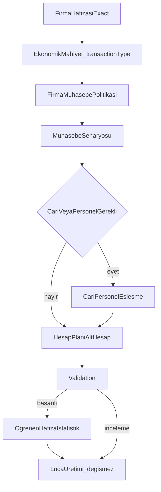

# Accounting Decision Engine

## Overview

Banka hareketlerinde cari-önce yaklaşımdan çıkıp, yeni bir senaryo motoru ile “hafıza → ekonomik mahiyet → **firma muhasebe politikası** → senaryo → cari gerekirse → validation → Luca” sırasını mapper’a bağlamak; CEK/KASA/POS/VIRMAN vb. için cari aramayı kapatmak; başarılı validation sonrası Öğrenen Hafıza kullanım istatistiklerini güncellemek. Parser, analysisKey, Luca formatı ve Excel/IndexedDB’ye dokunulmayacak.

## Plan

# Banka muhasebe karar motoru revizyonu

## Mevcut durum (kısa)

[`bankMovementMapper.js`](src/utils/bankMovementMapper.js) bugün **önce** `resolveBankTransactionType`, **sonra** firma hafızası / öğrenme / kurallar / sistem, **en sonda** `applyCariResolution` çalıştırıyor. [`CEK`](src/utils/bankTransactionType.js) hâlâ `CARI_REQUIRED_TYPES` içinde → “ÇEK ÖDEMESİ” cari grubuna düşüyor. Aylık 103 alt hesap seçimi kodda yok.

## Hedef karar sırası (revize)

Cari eşleştirme **asla** 1. adım olmayacak.

### Revizyon 1 — Firma Muhasebe Politikası katmanı

`TransactionType` ile `Muhasebe Senaryosu` arasına firma bazlı politika katmanı eklenir.

Politika alanları (`accountingRules` / `companyPolicies`):

| Alan | Anlamı |
|------|--------|
| `useGivenChecksAccount` | 103 Verilen Çekler kullanılıyor mu? |
| `useReceivedChecksAccount` | 101 Alınan Çekler kullanılıyor mu? |
| `usePos108Accounts` | 108 POS hesapları kullanılıyor mu? |
| `useCash100Account` | 100 Kasa hesabı kullanılıyor mu? |
| `useFxSeparate102Accounts` | Döviz için ayrı 102 alt hesapları kullanılıyor mu? |

Akış:

1. Firma Hafızası Exact
2. Ekonomik Mahiyet / TransactionType
3. **Firma Muhasebe Politikası** (yukarıdaki bayraklar)
4. Muhasebe Senaryosu (politika false ise ilgili senaryo incelemeye düşer; kör 100/101/103/108 dayatma yok)
5. Cari veya Personel Gerekli mi?
6. Gerekliyse eşleştirme
7. Hesap planı / alt hesap
8. Validation
9. Luca

### Revizyon 2 — Başarılı validation sonrası Öğrenen Hafıza istatistikleri

Validation başarılı (eksik hesap / kritik uyarı yok) satırlarda, eşleşen Öğrenen Hafıza kaydı için güncelle:

- `usageCount` (+1)
- `successCount` (+1)
- `lastUsedAt` (şimdi)
- `confidence` (gerekirse, örn. başarılı kullanıma göre hafif yükseltme; tavan korunur)

Kaynak: Hafıza V2 (`accountMemoryV2`) ve/veya `learning_memory` usage API — mevcut `recordLearningMemoryUsage` / V2 `recordUsage` yolları genişletilir. Parser / analysisKey / performans mimarisine dokunulmaz.

## Mimari (yeni modül)

Yeni dosya: [`src/utils/bankAccountingScenarioEngine.js`](src/utils/bankAccountingScenarioEngine.js)

- `ACCOUNTING_SCENARIO` id’leri: `CEK_ODEMESI`, `CEK_TAHSILATI`, `KASA_BANKAYA_YATAN`, `BANKADAN_KASAYA_CEKILEN`, `POS_TAHSILAT`, `POS_KOMISYON`, `BANKA_ICI_VIRMAN`, `BANKALAR_ARASI_VIRMAN`, vergi/finans aileleri, `MUSTERI_TAHSILAT`, `TEDARIKCI_ODEME`, `DIGER_CARI_HAREKET`, `BILINMEYEN`, …
- `resolveAccountingScenario({ transactionType, direction, description, companyPolicies, companyPlans, date })` → `{ scenarioId, cariRequired, personelRequired, counterAccountHint, documentType, reviewReason, legs }`
- Senaryo → hesap adayları (plan içinde `101/103/100/108/360/361/102` alt hesap ara; **kör ana hesap atama yok** — alt hesap yoksa inceleme)
- Aylık verilen çekler: işlem tarihinin ayına göre plan’da `103.*` + ay adı / dönem anahtar kelimesi; bulunamazsa `requireSubAccount` + kategori “Çek hesabı 101/103 eksik”
- `buildAccountingDecision(movementContext)` tek çıktı nesnesi: mapper ve validation bunu okuyacak

Firma politikaları (varsayılan `true`): [`companyNormalize.js`](src/utils/companyNormalize.js) `accountingRules` altına:

- `useGivenChecksAccount`, `useReceivedChecksAccount`, `usePos108Accounts`, `useCash100Account`, `useFxSeparate102Accounts`

UI: mevcut Firma Yönetimi accountingRules bölümüne checkbox’lar ([`CompanyManagement.jsx`](app/muhasebe/components/CompanyManagement.jsx)); yeni menü yok.

## transactionType genişletmesi

[`bankTransactionType.js`](src/utils/bankTransactionType.js):

- Yeni tipler ekle: `CEK_ODEMESI`, `CEK_TAHSILATI`, `KASA_BANKAYA_YATAN`, `BANKADAN_KASAYA_CEKILEN`, `BANKA_ICI_VIRMAN`, `BANKALAR_ARASI_VIRMAN`, `MUSTERI_TAHSILAT`, `TEDARIKCI_ODEME`, `DIGER_CARI_HAREKET`, `NAKIT_CEKME` (alias `NAKIT_CEKIM`), `TURIZM_PAYI` vb. (listedeki set)
- Eski `CEK` / `CARI_ODEME` / `CARI_TAHSILAT` **alias** olarak map edilsin (geriye dönük)
- `detectFromText`: yön + anahtar kelime ile `CEK_ODEMESI` (CIKIS) vs `CEK_TAHSILATI` (GIRIS); kasa yatırma/çekme; virman ayrımı
- **`CARI_REQUIRED_TYPES` güncelle**: CEK/KASA/POS/VIRMAN/VERGI/FINANS/NAKIT **çıkar**; yalnızca `MUSTERI_TAHSILAT`, `TEDARIKCI_ODEME`, `DIGER_CARI_HAREKET`, `IS_AVANSI`, `GELEN_HAVALE`, `GIDEN_HAVALE` (+ senet ilk düzenleme gerekirse)
- Reminder metin kuralı korunur: çay/temizlik/… → cari ödeme/tahsilat, **DIRECT_EXPENSE yok**

## Mapper entegrasyonu (4 aşama korunur)

[`bankMovementMapper.js`](src/utils/bankMovementMapper.js) içinde `mapParsedRowToStandardMovement` sırası:

1. **Firma hafızası exact** (`resolveAccountMemoryV2Decision`) — auto ise account + saklı `transactionType`/`accountingScenario` uygula; full matcher atlanır (mevcut short-circuit genişletilir)
2. **Ekonomik mahiyet** `resolveBankTransactionType` (hafıza tip dayatmadıysa)
3. **Senaryo** `resolveAccountingScenario` → `counterAccountCode` adayı / review
4. Mevcut şirket kuralı / muhasebe kuralı / sistem ailesi yalnızca senaryo hesabı boşsa ve senaryo izin veriyorsa (çakışmayı senaryo öncelikli tut)
5. **Cari/personel** yalnız `scenario.cariRequired` / `personelRequired`
6. Plan alt hesap doğrulama / öneri
7. Movement alanları: `transactionType`, `accountingScenario`, `cariRequired`, `counterAccountCode`, `missingHesapCategory`

Dokunulmayanlar: parser, `normalizeBankAnalysisKey` / unique analiz, `bankMovementToStandardLucaRows` formatı, Excel/IndexedDB, GLN/GÖND description builders.

## Validation

[`previewExportValidation.js`](src/utils/previewExportValidation.js):

- Yeniden tip/senaryo **üretmesin**; `row.accountingScenario` / `row.missingHesapCategory` / `row.transactionType` doğrulasın
- Kategori önceliği (sabit sıra + tek sayım): Banka 102 → Çek 101/103 → Kasa 100 → POS 108 → Vergi/SGK → Finans → Personel → Cari → Diğer
- Yeni etiketler: `CEK_HESAP_EKSIK`, `KASA_HESAP_EKSIK` (mevcut POS/VERGI/FINANS/CARI ile)

## Öğrenen Hafıza V2

[`accountMemoryV2.js`](src/utils/accountMemoryV2.js):

- Kayıta `accountingScenario` alanı
- `inferMemoryDecisionType`: CEK/KASA/POS/VIRMAN → `DIRECT_ACCOUNT` / senaryo tipi; **CARI değil**
- Resolve: `decisionType===CARI` iken transactionType cari-forbidden ise **auto uygulama yok** + conflict/quarantine raporu (`isActive` soft veya `REVIEW`)
- Save path (banka-ekstresi learn): senaryo + transactionType yaz

## Testler (smoke, deploy yok)

Zorunlu senaryolar (unit/smoke): CEK_ODEMESI CIKIS → 103/102 cari yok; CEK_TAHSILATI; KASA yatırma/çekme; POS; GÖND→320 cari; GLN→120 cari; SGK; DÖVİZ. Build + lint ilgili dosyalar.

## Bilinçli varsayımlar

- Aylık 103: planda ay adı / dönem eşleşmesi; yoksa inceleme (kör `103` atama yok)
- Firma politikası false ise ilgili senaryo incelemeye düşer (zorla 100/108/103 dayatma yok)
- NFT/core `accountingDecisionEngine.js` bu işin dışında; banka mapper yolu tek kaynak

## Todos

- [x] **types-policies**: Expand bankTransactionType + company accountingRules (Firma Muhasebe Politikası bayrakları)
- [x] **scenario-engine**: Add bankAccountingScenarioEngine.js (policy → scenario → plan resolve, monthly 103)
- [x] **wire-mapper**: Reorder mapParsedRowToStandardMovement: memory → type → **policy** → scenario → cari → plan → validation → Luca
- [x] **memory-stats**: After successful validation, update usageCount / successCount / lastUsedAt / confidence
- [x] **validation-memory**: Reorder missing categories; memory V2 scenario + CARI quarantine
- [x] **tests-build**: Smoke 9 scenarios + Vakıfbank/Garanti regression + build/lint report

## Original User Requirements

ANNVERO Banka Parser muhasebe karar mimarisini revize ediyoruz.

Amaç:
Açıklamadan doğrudan cari arayan yapıdan çıkıp önce işlemin ekonomik mahiyetini belirleyen muhasebe karar motoruna geçmek.

ÖNEMLİ:
- Parserlara dokunma
- Ön izleme performansına dokunma
- analysisKey / unique optimizasyonuna dokunma
- Luca satır üretim formatına dokunma
- Excel / IndexedDB mimarisine dokunma
- Mevcut GLN. HVL / GÖND. HVL açıklama standartlarını bozma
- Yeni modül ekleme
- Mevcut 4 aşamalı akışı koru

==================================================
1) YENİ KARAR SIRASI
==================================================

Her banka hareketinde karar sırası kesin olarak şu olsun:

1. Firma hafızası exact
2. İşlemin ekonomik mahiyetini belirle
3. Muhasebe senaryosunu seç
4. Senaryo cari/personel gerektiriyor mu karar ver
5. Gerekliyse cari/personel eşleştir
6. Hesap planından doğru alt hesapları bul
7. İnceleme / kullanıcı onayı
8. Luca satırlarını oluştur

Cari eşleştirme hiçbir zaman ilk adım olmasın.

==================================================
2) MUHASEBE İŞLEM SINIFLANDIRICISI
==================================================

Aşağıdaki transactionType’ları tanımla:

- CEK_ODEMESI
- CEK_TAHSILATI
- KASA_BANKAYA_YATAN
- BANKADAN_KASAYA_CEKILEN
- BANKA_ICI_VIRMAN
- BANKALAR_ARASI_VIRMAN
- POS_TAHSILAT
- POS_KOMISYON
- POS_IADE
- POS_BLOKE
- GELEN_HAVALE
- GIDEN_HAVALE
- MUSTERI_TAHSILAT
- TEDARIKCI_ODEME
- MAAS
- MAAS_AVANSI
- IS_AVANSI
- KREDI_KARTI_ODEMESI
- KDV
- KDV2
- MUHSGK
- SGK
- MTV
- EMLAK_VERGISI
- KONAKLAMA_VERGISI
- TURIZM_PAYI
- DAMGA_VERGISI
- GECIKME_ZAMMI
- TRAFIK_CEZASI
- DOVIZ_ALIS
- DOVIZ_SATIS
- KUR_FARKI
- FON_ALIS
- FON_SATIS
- REPO
- TERS_REPO
- KREDI_KULLANIM
- KREDI_ANAPARA
- KREDI_FAIZ
- KMH_FAIZ
- FAIZ_GELIRI
- FAIZ_GIDERI
- BANKA_MASRAFI
- BSMV
- NAKIT_YATIRMA
- NAKIT_CEKME
- DIGER_CARI_HAREKET
- BILINMEYEN

==================================================
3) MUHASEBE SENARYOLARI
==================================================

Aşağıdaki temel kayıt mantıkları zorunlu:

A) ÇEK ÖDEMESİ
Açıklama:
- ÇEK ÖDEMESİ
- ÇEK BEDELİ
- ÇEK TAHSİLİ DEĞİL, bankadan çıkan verilmiş çek ödemesi

Cari aranmaz.

Kayıt:
103 Verilen Çekler ve Ödeme Emirleri BORÇ
102 Bankalar ALACAK

Aylık 103 alt hesap mantığı korunmalı:
- Ocak verilen çekler
- Şubat verilen çekler
- vb.

B) ÇEK TAHSİLATI
Cari aranmaz.

Kayıt:
102 Bankalar BORÇ
101 Alınan Çekler ALACAK

C) KASADAN BANKAYA YATAN
Açıklamalar:
- KASADAN YATAN
- ../.. TARİHLİ KASA
- KASA YATIRMA
- KASADAN BANKAYA

Cari aranmaz.

Kayıt:
102 Bankalar BORÇ
100 Kasa ALACAK

D) BANKADAN KASAYA ÇEKİLEN
Cari aranmaz.

Kayıt:
100 Kasa BORÇ
102 Bankalar ALACAK

E) POS TAHSİLATI
Cari aranmaz.

Kayıt:
102 Bankalar BORÇ
108 POS Hesapları ALACAK

F) POS KOMİSYONU
Cari aranmaz.

Kayıt:
POS Komisyon Gideri BORÇ
102 Bankalar ALACAK

G) BANKA İÇİ / BANKALAR ARASI VİRMAN
Cari aranmaz.

Kayıt:
102 ilgili banka hesabı BORÇ
102 diğer banka hesabı ALACAK

H) VERGİ / SGK
Cari aranmaz.

KDV/MUHSGK/SGK vb. ilgili 360/361 alt hesaplara gider.
Tahakkuk/beyanname yoksa kör dağıtım yapma; incelemeye bırak.

I) DÖVİZ ALIŞ / SATIŞ
Cari aranmaz.

TL ve döviz banka hesapları arasında kayıt.
Kur farkı gerekiyorsa ayrıca kur farkı hesabı.

J) FON / REPO / KREDİ / FAİZ
Cari aranmaz.
İlgili finansal varlık, kredi veya faiz hesaplarına gider.

K) GERÇEK CARİ HAREKETLER
Sadece:
- müşteri tahsilatı
- tedarikçi ödemesi
- iş avansı
- çek/senet ilk düzenleme değilse cari bağlantılı senaryolar

Cari eşleştirme burada çalışır.

==================================================
4) FİRMA MUHASEBE POLİTİKALARI
==================================================

Firma bazında politika desteği ekle; yeni menü açmak zorunlu değil, mevcut firma ayarlarında saklanabilir.

Varsayılanlar:
- verilen çekler hesabı kullanılır = true
- alınan çekler hesabı kullanılır = true
- POS 108 hesapları kullanılır = true
- kasa 100 hesabı kullanılır = true
- döviz için ayrı 102 alt hesapları kullanılır = true

Bu firmalarda:
- çek ödemesinde cari aranmaz
- kasa/banka virmanında cari aranmaz
- POS’ta cari aranmaz

==================================================
5) CARİ GEREKLİ Mİ KARARI
==================================================

transactionType bazında:

Cari gerektirmeyenler:
- CEK_ODEMESI
- CEK_TAHSILATI
- KASA_BANKAYA_YATAN
- BANKADAN_KASAYA_CEKILEN
- VİRMAN
- POS
- VERGİ/SGK
- DÖVİZ
- FON/REPO
- KREDİ
- FAİZ
- BANKA MASRAFI
- BSMV
- NAKİT hareketleri

Cari gerekenler:
- MUSTERI_TAHSILAT
- TEDARIKCI_ODEME
- DIGER_CARI_HAREKET
- IS_AVANSI
- bazı çek/senet ilk düzenleme senaryoları

Personel gerekenler:
- MAAS
- MAAS_AVANSI

==================================================
6) SERBEST AÇIKLAMA KURALI
==================================================

Şunlar tek başına doğrudan gider anlamına gelmez:

- çay parası
- temizlik malzemesi
- bakım
- kargo
- aidat
- konaklama
- malzeme
- yemek

Bunlar çoğu zaman cari ödeme açıklamasıdır.

Karar:
- hareket CARI_ODEME ise cari bul
- DIRECT_EXPENSE üretme
- yalnız banka masrafı, komisyon, BSMV, faiz gibi sistem kaynaklı işlemler doğrudan gider olabilir

==================================================
7) VALIDATION
==================================================

Validation yeniden muhasebe kararı vermesin.

Sadece nihai accountingDecision’ı doğrulasın.

Eksik kategori önceliği:

1. Banka hesabı eksik
2. Çek hesabı 101/103 eksik
3. Kasa hesabı 100 eksik
4. POS hesabı 108 eksik
5. Vergi/SGK hesabı eksik
6. Finans hesabı eksik
7. Personel eksik
8. Gerçek cari eksikliği
9. Diğer

Aynı movement yalnızca bir kez sayılsın.

==================================================
8) ÖĞRENEN HAFIZA İLE UYUM
==================================================

Hafıza V2 işlem türü ve muhasebe senaryosunu saklasın.

Örneğin:
- ÇEK ÖDEMESİ → 103
- KASADAN YATAN → 100
- POS BATCH → 108

Bunlar cari hafızası olarak değil, transactionType/accountingScenario hafızası olarak saklansın.

Yanlışlıkla geçmişte cariye öğretilmiş:
- ÇEK ÖDEMESİ
- KASA
- POS
- VİRMAN
kayıtlarını otomatik uygulama dışına al ve çakışma raporuna düşür.

==================================================
9) TEST SENARYOLARI
==================================================

Zorunlu testler:

1. ÇEK ÖDEMESİ / CIKIS
Beklenen:
103 BORÇ / 102 ALACAK
Cari yok

2. ÇEK TAHSİLATI / GIRIS
Beklenen:
102 BORÇ / 101 ALACAK
Cari yok

3. KASADAN YATAN / GIRIS
Beklenen:
102 BORÇ / 100 ALACAK
Cari yok

4. BANKADAN KASAYA / CIKIS
Beklenen:
100 BORÇ / 102 ALACAK
Cari yok

5. POS BATCH / GIRIS
Beklenen:
102 BORÇ / 108 ALACAK
Cari yok

6. GÖND. HVL tedarikçi
Beklenen:
320 BORÇ / 102 ALACAK
Cari gerekli

7. GLN. HVL müşteri
Beklenen:
102 BORÇ / 120 ALACAK
Cari gerekli

8. SGK
Beklenen:
361 BORÇ / 102 ALACAK
Cari yok

9. DÖVİZ ALIŞ
Beklenen:
102 döviz / 102 TL
Cari yok

==================================================
10) BAŞARI KRİTERLERİ
==================================================

- ÇEK ÖDEMESİ artık Cari bulunamadı grubuna düşmemeli
- KASA açıklamaları cari grubuna düşmemeli
- POS/virman/vergi/finans cari grubuna düşmemeli
- GLN/GÖND cari akışı bozulmamalı
- 1416 hareket → 2832 Luca satırı korunmalı
- Garanti akışı bozulmamalı
- Analiz süresi mevcut bandı aşmamalı
- Eksik hesap sayısı ekonomik mahiyet sınıflandırmasıyla belirgin düşmeli
- Öğrenen Hafıza V2 doğru işlem tipini tekrar kullanmalı

==================================================
11) İŞLEM SONU RAPORU
==================================================

Raporla:

- değiştirilen dosyalar
- yeni karar ağacı
- transactionType → muhasebe senaryosu tablosu
- cari gerektirmeyen işlem sayısı
- çek ödemesi eski/yeni davranış
- kasa işlemi eski/yeni davranış
- POS eski/yeni davranış
- Vakıfbank test sonucu
- Garanti regresyon sonucu
- analiz süresi
- eksik hesap eski/yeni
- build sonucu
- yeni lint hatası var mı

Ben açıkça “deploy onayla” demeden:
- commit alma
- push yapma
- deploy tetikleme